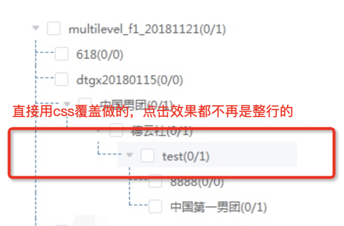

# element-tree-line


这是一个给 [element-ui](https://element.eleme.io/#/zh-CN/component/tree)和[element-plus](https://element-plus.gitee.io/zh-CN/component/tree.html)的 `el-tree` 添加结构线的子组件，不会对 `el-tree` 原有的功能造成任何的影响，同时能够支持[element-plus 的 Virtualized Tree 虚拟树](https://element-plus.org/zh-CN/component/tree-v2.html)，有了线的展示，从美观和树形结构清晰上都有很好的体现。（我总是在做不是很重要的东西，哈哈）

## 安装与使用

```bash
# npm
npm install element-tree-line -S

# yarn
yarn add element-tree-line -S

```

### Used in vue2 + element-ui

```js
// 全局注册组件
import Vue from 'vue';
import ElementTreeLine from 'element-tree-line';
// css
import 'element-tree-line/dist/style.css';
// or scss
// import 'element-tree-line/dist/style.scss';

Vue.component(ElementTreeLine.name, ElementTreeLine);
```

```js
// or 局部注册组件
import ElementTreeLine from 'element-tree-line';
// css
import 'element-tree-line/dist/style.css';
// or scss
// import 'element-tree-line/dist/style.scss';

export default {
    components: { ElementTreeLine },
    data() {
        return {};
    },
};
```

**案例效果**


```html
<template>
    <el-card shadow="never" :body-style="{ padding: '20px 0px 20px 20px' }">
        <div style="margin-bottom: 10px">
            <span style="margin-right: 5px">showLabelLine</span>
            <el-switch v-model="treeProps['showLabelLine']"></el-switch>
            <span style="margin-left: 20px;margin-right:5px;">indent</span>
            <el-input-number v-model="treeProps['indent']"></el-input-number>
        </div>
        <el-tree
            ref="tree"
            :data="data"
            draggable=""
            show-checkbox
            node-key="id"
            :default-expanded-keys="[2, 3]"
            :default-checked-keys="[5]"
            :props="defaultProps"
            :indent="treeProps['indent']"
        >
            <template v-slot:default="{ node }">
                <element-tree-line
                    :node="node"
                    :showLabelLine="treeProps['showLabelLine']"
                    :indent="treeProps['indent']"
                >
                    <!-- 自定义label的slot -->
                    <template v-slot:node-label>
                        <span style="font-size: 12px">
                            {{ node.label }}
                            <i class="el-icon-eleme"></i
                        ></span>
                    </template>
                    <!-- 在右边追加内容的slot -->
                    <template v-slot:after-node-label>
                        <span style="padding-right: 10px">
                            <el-button
                                type="primary"
                                size="mini"
                                @click.stop="openDrawer(node)"
                                >新增子节点</el-button
                            >
                            <el-button
                                type="primary"
                                size="mini"
                                @click.stop="openDrawer(node)"
                                >修改</el-button
                            >
                            <el-button
                                type="danger"
                                size="mini"
                                @click.stop="openDialog"
                                >删除</el-button
                            ></span
                        >
                    </template>
                </element-tree-line>
            </template>
        </el-tree>
    </el-card>
</template>
<script>
    import ElementTreeLine from 'element-tree-line';
    import 'element-tree-line/dist/style.css';
    export default {
        components: { ElementTreeLine },
        data() {
            return {
                treeProps: {
                    indent: 16,
                    showLabelLine: true,
                },
                data: [
                    {
                        id: 1,
                        label: '一级 1',
                        children: [
                            {
                                id: 4,
                                label: '二级 1-1',
                                children: [
                                    {
                                        id: 9,
                                        label: '三级 1-1-1',
                                    },
                                    {
                                        id: 10,
                                        label: '三级 1-1-2',
                                    },
                                ],
                            },
                            {
                                id: 9000,
                                label: '二级 1-2',
                            },
                        ],
                    },
                    {
                        id: 2,
                        label: '一级 2',
                        children: [
                            {
                                id: 5,
                                label: '二级 2-1',
                            },
                            {
                                id: 6,
                                label: '二级 2-2',
                            },
                        ],
                    },
                    {
                        id: 3,
                        label: '一级 3',
                        children: [
                            {
                                id: 7,
                                label: '二级 3-1',
                            },
                            {
                                id: 8,
                                label: '二级 3-2',
                            },
                        ],
                    },
                ],
                defaultProps: {
                    children: 'children',
                    label: 'label',
                },
            };
        },
    };
</script>
<style>
    .el-tree-node__content {
        padding-top: 5px;
        padding-bottom: 5px;
    }
</style>
```

### Used in vue3 + element-plus

```js
// 全局注册组件
import { createApp, h } from 'vue';
import { getElementLabelLine } from 'element-tree-line';
// css
import 'element-tree-line/dist/style.css';
// or scss
// import 'element-tree-line/dist/style.scss';

// 创建一个Vue 应用
const app = Vue.createApp({});
// 全局注册ElementLabelLine
const ElementLabelLine = getElementLabelLine(h);
app.component(ElementLabelLine.name, ElementLabelLine);
```

```js
// or 局部注册组件
import { getElementLabelLine } from 'element-tree-line';
// css
import 'element-tree-line/dist/style.css';
// or scss
// import 'element-tree-line/dist/style.scss';
import { h } from 'vue';
export default {
    components: { ElementTreeLine: getElementLabelLine(h) },
    data() {
        return {};
    },
};
```

**案例效果**


```html
<template>
    <el-tree
        :data="data"
        show-checkbox
        node-key="id"
        draggable
        :default-expanded-keys="[2, 3]"
        :default-checked-keys="[5]"
        :props="defaultProps"
        :indent="treeIndent"
        ><template v-slot:default="{ node }">
            <element-tree-line
                :node="node"
                :showLabelLine="true"
                :indent="treeIndent"
            >
                <template v-slot:node-label>
                    <span style="font-size: 12px">
                        {{ node.label }}
                        <el-tag type="danger" size="mini">Tag 5</el-tag>
                    </span>
                </template>
                <template v-slot:after-node-label>
                    <span style="padding-right: 10px">
                        <el-button size="mini">按钮</el-button>
                    </span>
                </template>
            </element-tree-line>
        </template>
    </el-tree>
</template>
<script>
    import { getElementLabelLine } from 'element-tree-line';
    import 'element-tree-line/dist/style.css';
    import { h } from 'vue';
    export default {
        components: { ElementTreeLine: getElementLabelLine(h) },
        data() {
            return {
                treeIndent: 30,
                data: [
                    {
                        id: 1,
                        label: 'Level one 1',
                        children: [
                            {
                                id: 4,
                                label: 'Level two 1-1',
                                children: [
                                    {
                                        id: 9,
                                        label: 'Level three 1-1-1',
                                    },
                                    {
                                        id: 10,
                                        label: 'Level three 1-1-2',
                                    },
                                ],
                            },
                        ],
                    },
                    {
                        id: 2,
                        label: 'Level one 2',
                        children: [
                            {
                                id: 5,
                                label: 'Level two 2-1',
                            },
                            {
                                id: 6,
                                label: 'Level two 2-2',
                            },
                        ],
                    },
                    {
                        id: 3,
                        label: 'Level one 3',
                        children: [
                            {
                                id: 7,
                                label: 'Level two 3-1',
                            },
                            {
                                id: 8,
                                label: 'Level two 3-2',
                            },
                        ],
                    },
                ],
                defaultProps: {
                    children: 'children',
                    label: 'label',
                },
            };
        },
    };
</script>
<style>
    .el-tree-node__content {
        padding-top: 5px;
        padding-bottom: 5px;
    }
</style>
```

### Used in element-plus Virtualized Tree 虚拟树

**案例效果**


```html
<template>
    <el-tree-v2
        :data="treeData"
        :props="props"
        :indent="treeIndent"
        :height="400"
    >
        <template v-slot:default="{ node }">
            <element-tree-line
                :node="node"
                :treeData="treeData"
                :showLabelLine="true"
                :indent="treeIndent"
            >
            </element-tree-line>
        </template>
    </el-tree-v2>
</template>
<script lang="ts">
    import { defineComponent, ref } from 'vue';
    import { getElementLabelLine } from 'element-tree-line';
    import 'element-tree-line/dist/style.css';
    import { h } from 'vue';
    const getKey = (prefix, id) => {
        return `${prefix}-${id}`;
    };

    const createData = (
        maxDeep,
        maxChildren,
        minNodesNumber,
        deep = 1,
        key = 'node'
    ) => {
        let id = 0;
        return new Array(minNodesNumber).fill(deep).map(() => {
            const childrenNumber =
                deep === maxDeep ? 0 : Math.round(Math.random() * maxChildren);
            const nodeKey = getKey(key, ++id);
            return {
                id: nodeKey,
                label: nodeKey,
                children: childrenNumber
                    ? createData(
                          maxDeep,
                          maxChildren,
                          childrenNumber,
                          deep + 1,
                          nodeKey
                      )
                    : undefined,
            };
        });
    };
    export default defineComponent({
        components: { ElementTreeLine: getElementLabelLine(h) },
        setup() {
            return {
                treeData: createData(4, 30, 40),
                treeIndent: 40,
                props: ref({
                    id: 'id',
                    label: 'label',
                    children: 'children',
                }),
            };
        },
    });
</script>
```

### ElementLabelLine Props

| 参数          | 说明                                                                                                                                                                      | 类型    | 可选值 | 默认值 |
| ------------- | ------------------------------------------------------------------------------------------------------------------------------------------------------------------------- | ------- | :----: | ------ |
| node          | 由[el-tree 的 default slot](https://element-plus.gitee.io/zh-CN/component/tree.html#slots) 提供的作用域参数 node，**必填**。                                              | object  |   -    | -      |
| showLabelLine | 是否显示 label 的横线                                                                                                                                                     | boolean |   -    | false  |
| treeData      | 对应[element-plus 的 el-tree-v2](https://element-plus.org/zh-CN/component/tree-v2.html#attributes) 的 data，**当用在 element-plus 的 el-tree-v2 时，treeData 是必填的**。 | array   |   -    | -      |
| indent        | 相邻级节点间的水平缩进，单位为像素 ; 对应[el-tree 的 indent](https://element-plus.gitee.io/zh-CN/component/tree.html#attributes)。                                        | number  |   -    | 16     |

### ElementLabelLine Slots

| 插槽名称         | 说明                   |
| ---------------- | ---------------------- |
| node-label       | 自定义 label 区域      |
| after-node-label | 追加在 label line 之后 |

### 修改线的样式

如果使用的是scss，可以覆盖scss变量修改线的颜色

```scss
$--element-tree-line-color: #dcdfe6;
$--element-tree-line-style: dashed;
$--element-tree-line-width: 1px;
@import 'element-tree-line/dist/style.scss';
```

## 对比其他方式

在做 ElementLabelLine 之前，看 element-ui issues 有不少人提到 el-tree 结构线的需求，官方依然没有支持，有搜索到一些直接覆盖 el-tree 的 css 做法，在节点缩进、点击行效果、拖拽等方面没有很贴合的效果，并不是我想要的



ElementLabelLine 作为 el-tree 子组件的方式，无侵入性，可插拔，很优雅的添加结构线。
